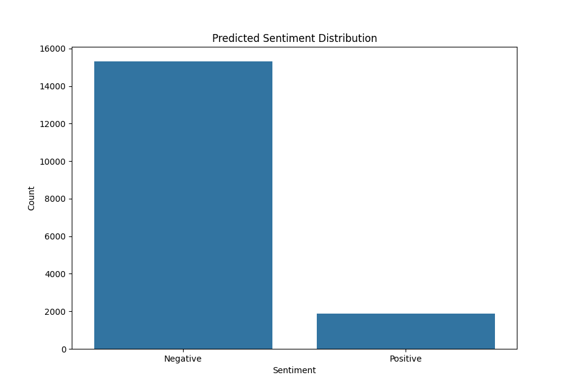

# Twitter Sentiment Analysis

This project demonstrates the use of Apache Spark and machine learning techniques to perform sentiment analysis on a dataset of tweets. The goal is to classify each tweet as having either a positive or negative sentiment.

## Project Overview

The project follows these main steps:

1. Data Preprocessing:
   - Remove specific patterns and convert all text to lowercase.
   - Filter out empty tweets.

2. Feature Extraction:
   - Tokenize the tweets into individual words.
   - Remove stop words.
   - Apply TF-IDF (Term Frequency-Inverse Document Frequency) to convert the text data into numerical features.

3. Model Training:
   - Train a logistic regression model using the extracted features and labeled data.

4. Model Evaluation:
   - Make predictions on the test dataset using the trained model.
   - Visualize the distribution of predicted sentiment labels.

## Data Processing Framework

This project utilizes Apache Spark, a popular data processing framework, to handle large-scale data processing tasks. Spark provides distributed computing capabilities and allows for efficient processing of big data.

## Machine Learning Pipeline

The machine learning pipeline in this project consists of the following components:

- Tokenizer: Splits the text into individual words.
- StopWordsRemover: Removes common stop words from the tokenized text.
- HashingTF: Converts the tokenized words into numerical features using the hashing trick.
- IDF: Applies Inverse Document Frequency to rescale the feature values.
- LogisticRegression: Trains a logistic regression model for sentiment classification.

## Data Quality and Mixture

Special attention has been given to data quality and mixture in this project:

- Preprocessing steps ensure that the text data is cleaned and standardized before feature extraction.
- The dataset used for training and testing the model has been carefully curated to ensure a balanced representation of positive and negative sentiments.

## Visualization

The project includes a visualization of the predicted sentiment distribution using a bar plot. This provides insights into the proportion of positive and negative sentiments in the analyzed tweets.

## Requirements

To run this project, you need the following dependencies:

- Apache Spark